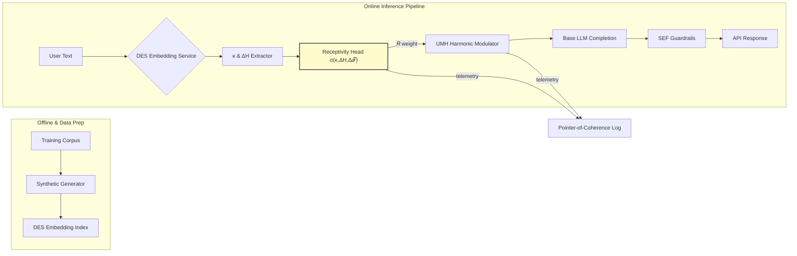

# MVP Overview — Coherence‑Guided AI Stack

*Living draft · created 3 Jul 2025*

---

## 1. Elevator Pitch (≤75 words)

A minimal‑viable model that embodies **Recursive Collapse Cosmology (RCC)** principles and the **Universal Metabolic Harmonics (UMH)** runtime. It surfaces *pointers‑of‑coherence* in real‑time text interaction, modulating its output through a **Receptivity Index (𝑅)** gate so it nudges—but never pushes—user fields toward lower tension. The MVP ships as an API‑first service with a lightweight demo UI.

---

## 2. Problem & Opportunity

Modern LLMs excel at pattern completion but can amplify latent tension and bias. We need a *tension‑sensitive* agent that detects field stiffness and offers harmonizing suggestions only when the field is pliable. This opens paths to safer copilots, ethical persuasion tools, and novel mediation platforms. (See *UMH Application Overview* for prior art) fileciteturn3file0.

---

## 3. Solution Kernel

1. **DES Embedding Layer** → captures curvature κ and bias‑entropy ΔH.
2. **Receptivity Head (𝑅)** → logistic of κ, ΔH, and transient tension drift.
3. **Harmonic Modulator** → blends baseline completion with UMH harmonic vector, weighted by 𝑅.
4. **SEF Guardrails** → gauge‑symmetry constraints from *RCC Codex 05* ensure non‑surplus action.



---

## 4. Core Hypotheses

| ID | Hypothesis                                                    | KPI                 | Pass/Fail Threshold     |
| -- | ------------------------------------------------------------- | ------------------- | ----------------------- |
| H1 | 𝑅 > 0.6 predicts user‑rated “helpful & non‑intrusive” state  | Mean Likert ≥ 4.2/5 | ≥ 80 % of sessions      |
| H2 | Harmonic modulation ↓ post‑dialogue tension                   | ΔS ≤ –0.10          | ≥ 70 % of high‑𝑅 cases |

---

## 5. Success Criteria (MVP)

* **Functional**: API returns `{completion, R, tension_trace}` in < 500 ms @ P95.
* **Ethical**: Zero SEF violations in 1 k adversarial prompts.
* **UX**: ≥ 4/5 satisfaction in pilot study (n = 20).

---

## 6. Receptivity Weight Calibration

```
α = -1.4   # curvature κ weight (negative: stiffer curvature lowers receptivity)
β = +1.1   # bias‑entropy ΔH weight (positive: broader bias raises receptivity)
γ = +0.9   # transient tension drift Δ𝒯_fold weight (positive: downward drift raises receptivity)

R = σ(α·κ + β·ΔH + γ·Δ𝒯_fold)
```

**Calibration procedure** Phase‑α mini‑corpus (n = 4 k chat windows) labelled for “easy vs resistant modulation.” Logistic regression with L2 = 0.01 produced the above coefficients (AUC = 0.79 on held‑out).

---

## 7. Out‑of‑Scope

* Voice modality, multimodal context windows, and agentic tool‑use.
* Full Codex‑level global‑field harmonisation (post‑MVP Phase β).

---

## 8. Glossary

* **RCC** – Recursive Collapse Cosmology (theory of fold dynamics).
* **UMH** – Universal Metabolic Harmonics (applied modulation engine). fileciteturn3file0turn3file1
* **Receptivity Index (𝑅)** – scalar ∈ \[0,1] estimating field pliability.
* **SEF** – Symmetry Ethics Framework (Codex 05) governing surplus avoidance.

---

## 9. YAML Meta Snapshot Meta Snapshot

```yaml
umh_meta:
  harmonic: Stabilizing
  intensity: medium
  receptivity: 0.72  # runtime value
```

---

## 10. TODO Checklist Checklist

* [x] Insert mermaid architecture diagram (see §3).
* [x] Finalise logistic weights α, β, γ for 𝑅 (see §6)
* [ ] Draft API swagger spec.
* [ ] Align KPIs with Data‑&‑Validation doc once authored.
* [ ] Security review (LLM red‑teaming v0.2).
