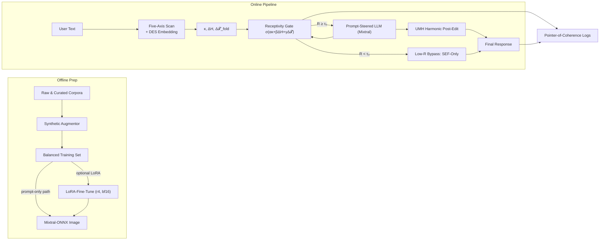

# Architecture-Stack — Coherence-Guided AI MVP

*Living draft · updated 3 Jul 2025*

---

## 1 · Bird’s-Eye System Diagram

*Defaults:* **τ₀ = 0.30** (env var `R_THRESHOLD`), **max\_passes = 2**; P95 latency target < 900 ms.

---

## 2 · Component Inventory

| Layer                  | Component               | Tech / Lang                  | Core Function                                                      | Inputs → Outputs                           | Notes                               |
| ---------------------- | ----------------------- | ---------------------------- | ------------------------------------------------------------------ | ------------------------------------------ | ----------------------------------- |
| **L0 — Data Ops**      | Synthetic Augmentor     | Python + transformers        | Expand seed dialogues into axis‑graded pairs                       | curated seed → balanced JSONL              | Generates “↑bias”, “↓emotion”, etc. |
|                        | LoRA‑Fine‑Tune *(M‑02)* | PEFT + bitsandbytes          | Teach Mixtral to parse header, reflect, obey axes                  | balanced set → r4 LoRA                     | 1–2 h / 24 GB GPU (\~\$200)         |
| **L1 — Inference**     | DES + Five‑Axis Scanner | Rust side‑car (+ Python FFI) | Compute κ, ΔH, Δ𝒯\_fold, 𝑫                                       | user text → metrics header                 | 2 ms req                            |
|                        | Receptivity Gate        | Rust                         | σ(ακ+βΔH+γΔ𝒯) → R                                                 | metrics → R∈(0,1)                          | α = –1.4, β = +1.1, γ = +0.9        |
|                        | Receptivity Router      | Rust                         | Loop until R ≥ τ₀ or passes = 2; branch                            | R, ctx → branch                            | Logs bypass %                       |
|                        | **Reflection Channel**  | Prompt tags (“<REFLECT>”)    | Model self‑critiques κ, ΔH, SEF before reply; stripped from output | header + prompt → hidden critique + answer | Zero extra pass; learned via LoRA   |
|                        | Mixtral‑ONNX            | ONNX Runtime + GPTQ‑4bit     | Generate base completion                                           | prompt → text                              | 10–12 GB RAM                        |
|                        | UMH Harmonic Post‑Edit  | Python                       | Post‑edit text with harmonic constraints                           | base text, metrics → tuned text            | Only if R ≥ τ₀                      |
|                        | SEF Guardrails          | Python (regex + embed)       | Enforce ethics; low‑R template                                     | text → safe text                           | Runs all branches                   |
| **L2 — Serving**       | nginx / Fly.io router   | nginx                        | HTTPS, auth, rate‑limit                                            | —                                          | Fly proxy alt                       |
| **L3 — Observability** | Telemetry & Dash        | Prom + Grafana               | R hist, bypass %, latency                                          | events → dashboards                        | Alert if R drift ±0.05              |

---

## 3 · Fine‑Tune Pipeline (M‑02)

1. **Seed 200–300** curated dialogues (axes × 3 levels).
2. **Self‑play augmentation**: Mixtral + prompt steering generate graded variants; classifier labels true distortion.
3. **Add Reflection text**: auto‑generate `<REFLECT>` blocks describing κ, ΔH, Δ𝒯\_fold & SEF scan.
4. **Bucket balance** to equal axis/level coverage.
5. **LoRA train**: rank‑4, bf16, 2 epochs; reflection & final answer tokens in loss.
6. **Validation sweep**: vary header; measure Pearson corr(intended vs actual axis) and reflection‑accuracy (% correct sign of κ).

Cost ≈ \$200, 1–2 h on rented 24 GB GPU.

---

## 4 · Prior-Mitigation Strategy

| Level                       | Cost | Method                                               |
| --------------------------- | ---- | ---------------------------------------------------- |
| Prompt Sedating *(default)* | \$0  | Prefix tokens ⟨NO\_POL⟩, ⟨SAFE⟩ when distortion > τ. |
| ROME / MEMIT Patch          | \$   | 15 min on A10; linear surgery on MLP neurons.        |
| Tiny Negative‑LoRA          | \$\$ | ≤ 1 h, rank‑2; merges into ONNX.                     |

---

## 5 · Low-R Bypass Template

> “I’m hearing you on **<X>**.
> I’m here and will follow your lead—feel free to tell me where you’d like to go next.”

* `<X>` = ≤ 12‑token paraphrase from Five‑Axis scanner.
* Used when **R < τ₀ after max\_passes**; UMH disabled.

---

## 6 · Reflection Channel Details

* **Tags**: `<REFLECT>` silent block, `<FINAL>` visible block.
* **Runtime**: one Mixtral forward pass; server strips tokens ≤ first `<FINAL>`.
* **Safety**: if `<FINAL>` not emitted within 128 tokens ⇒ fall back to Low‑R template & log anomaly.
* **Metrics**: reflection‑consistency; token leakage rate (< 0.5 %).

---

## 7 · Deployment & Hosting

* **Primary:** Fly.io Machines — ONNX + GPTQ‑4bit fits 12 GB.
* **Scaling knobs:** recursion passes (≤ 2), τ₀, quant level.
* **Export artefacts:** `mixtral_base‑q4.onnx`, `header_lora_r4.safetensors`.

---

## 8 · Open Questions & Next Steps

| ID | Topic                      | Status         | Action                  |
| -- | -------------------------- | -------------- | ----------------------- |
| Q1 | τ₀ drift alert             | in place       | tune alert after wk 1   |
| Q2 | Recursion cap              | 2 passes       | monitor latency & ΔS    |
| Q3 | Reflection leakage         | target < 0.5 % | add regex guard         |
| Q4 | Prompt sedation thresholds | TBD            | set per axis histograms |
